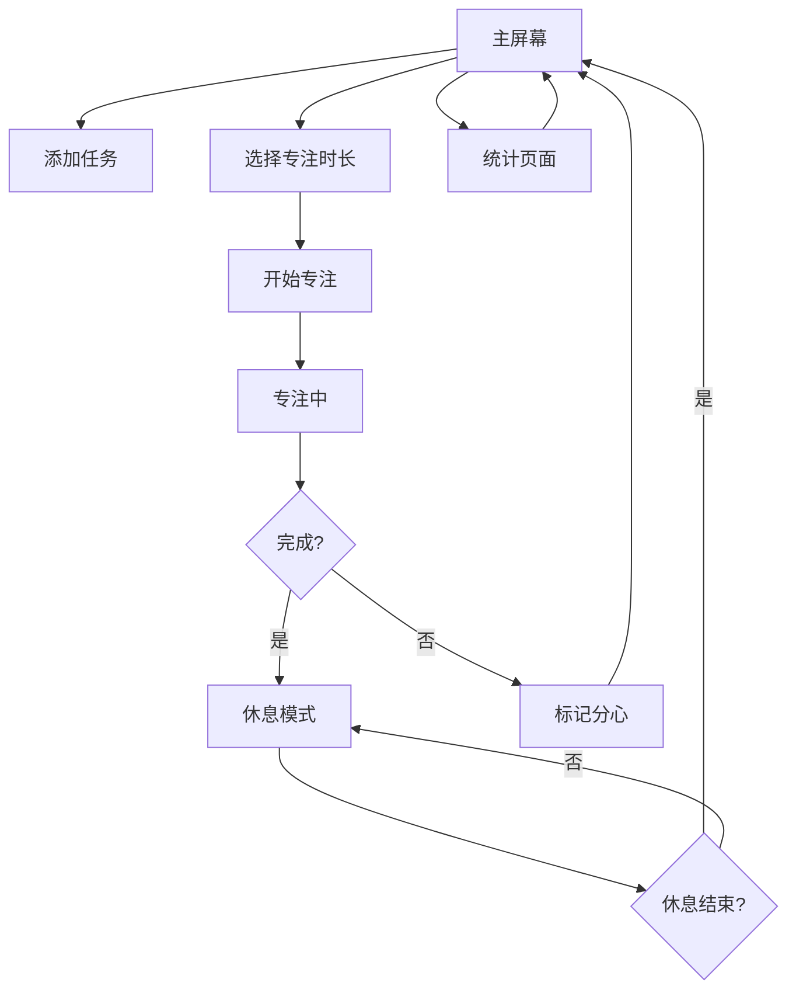

# DeepFocus 产品文档

## 1. 产品概述

DeepFocus是一款现代化的专注计时应用，旨在帮助用户提高生产力，减少分心，培养良好的工作习惯。通过结合番茄工作法的核心原理与现代UI设计，为用户提供直观、高效的专注体验。

- **解决问题**：现代生活中注意力分散严重，用户难以保持长时间专注，缺乏有效的时间管理工具。
- **目标用户**：学生、专业人士、自由工作者等需要集中注意力完成任务的人群。
- **产品价值**：通过结构化的专注-休息循环，帮助用户建立专注习惯，提高工作效率，同时通过数据分析提供个性化的专注改进建议。

## 2. 核心功能

### 2.1 功能模块

| 模块 | 功能描述 | 优先级 |
|------|---------|--------|
| 专注计时 | 提供15/25/45分钟可选择的专注计时器，带有视觉进度环和声音提示 | 高 |
| 任务管理 | 支持添加、标记完成、删除每日核心任务（最多3个） | 高 |
| 分心跟踪 | 允许用户记录分心原因，分类统计以提供改进建议 | 中 |
| 休息模式 | 专注完成后自动进入5分钟休息模式 | 高 |
| 数据统计 | 提供每日和每周专注数据统计，包括专注时间、完成任务数等 | 中 |
| 趋势分析 | 生成每周专注趋势图表和个性化洞察 | 中 |

### 2.2 页面详情

| 页面名称 | 模块名称 | 功能描述 |
|---------|---------|--------|
| 主屏幕 | 统计卡片 | 显示今日专注时间、目标进度、完成番茄数、任务数和分心次数 |
| 主屏幕 | 任务列表 | 展示每日核心任务，支持添加、标记完成和删除任务 |
| 主屏幕 | 开始专注 | 选择专注时长并启动专注计时器 |
| 专注页面 | 计时器 | 显示剩余时间、当前任务、进度环 |
| 专注页面 | 控制按钮 | 暂停/继续计时，标记分心 |
| 专注页面 | 分心记录 | 提供分心原因分类选项 |
| 休息页面 | 倒计时 | 显示剩余休息时间 |
| 休息页面 | 结束按钮 | 手动结束休息返回主屏幕 |
| 统计页面 | 周趋势图 | 展示本周每日专注时间柱状图 |
| 统计页面 | 洞察卡片 | 显示最高专注日和个性化复盘建议 |

## 3. 核心流程

### 用户操作流程

1. **启动应用**：进入主屏幕，查看今日统计和任务列表
2. **添加任务**：点击"+"按钮添加核心任务（最多3个）
3. **选择专注时长**：在15/25/45分钟中选择合适的时长
4. **开始专注**：点击"开始专注"按钮进入专注模式
5. **专注过程**：查看剩余时间，可暂停/继续，或标记分心
6. **完成专注**：专注时间结束后自动进入5分钟休息模式
7. **休息结束**：休息时间结束后返回主屏幕，任务完成情况更新
8. **查看统计**：点击统计按钮进入统计页面，查看周趋势和洞察

## 4. 用户界面设计

### 4.1 设计风格

- **主色调**：蓝色 (#3B82F6) 和绿色 (#10B981)，代表专注和完成
- **辅助色**：橙色 (#F59E0B) 用于警告和提示，红色 (#EF4444) 用于错误和删除
- **背景色**：浅灰色 (#F9FAFB) 提供干净的视觉背景
- **文字色**：深灰色 (#1F2937) 为主文字，中灰色 (#6B7280) 为次要文字
- **按钮风格**：圆角矩形按钮，带有轻微阴影，点击时有反馈动画
- **字体**：系统圆角字体，标题使用粗体，正文使用常规字重
- **布局风格**：卡片式布局，元素间距适中，视觉层次清晰

### 4.2 页面设计概览

| 页面名称 | 模块名称 | UI元素 |
|---------|---------|--------|
| 主屏幕 | 统计卡片 | 卡片式设计，包含今日专注时间、进度条、完成番茄数、任务数和分心次数，使用不同颜色区分数据类型 |
| 主屏幕 | 任务列表 | 任务卡片显示任务标题和番茄进度，未完成任务显示空心圆，完成任务显示绿色对勾 |
| 主屏幕 | 开始专注 | 三个时长选择按钮（15/25/45分钟），选中状态有蓝色边框高亮，下方是绿色"开始专注"按钮 |
| 专注页面 | 计时器 | 中央大圆形进度环，显示剩余时间，进度环颜色为蓝色，随时间减少 |
| 专注页面 | 控制按钮 | 暂停/继续按钮（圆形，蓝色），标记分心按钮（橙色） |
| 休息页面 | 倒计时 | 中央大字体显示剩余休息时间，绿色主题，顶部有咖啡杯图标 |
| 统计页面 | 周趋势图 | 柱状图显示每日专注时间，超过60分钟的柱子为绿色，否则为蓝色 |
| 统计页面 | 洞察卡片 | 最高专注日卡片（橙色主题），复盘建议卡片（红色主题） |

### 4.3 响应式设计

- **适配设备**：支持iPhone和iPad，使用SwiftUI的自适应布局
- **横竖屏适配**：在iPad上支持横屏模式，布局会自动调整
- **字体大小**：使用动态类型，支持系统字体大小设置
- **触控目标**：所有可点击元素的触控区域不小于44x44像素，符合iOS人机界面指南

## 5. 技术实现

### 5.1 技术栈

- **开发语言**：Swift 5.9+
- **UI框架**：SwiftUI 5.0+
- **状态管理**：Observable (iOS 17+)
- **数据持久化**：UserDefaults
- **数据可视化**：Charts框架
- **动画效果**：SwiftUI内置动画
- **设备要求**：iOS 17.0+，支持iPhone和iPad

### 5.2 核心架构

- **MVVM架构**：Model-View-ViewModel模式，分离数据、视图和业务逻辑
- **状态管理**：使用@Observable类FocusStore管理应用状态
- **数据模型**：Task（任务）、FocusSession（专注会话）、DailyStats（每日统计）
- **视图组织**：ContentView作为导航容器，管理不同页面的切换
- **动画效果**：使用SwiftUI的withAnimation和transition实现页面过渡和状态变化动画

### 5.3 关键功能实现

- **专注计时器**：使用Timer.publish实现倒计时，结合Circle的trim属性实现进度环动画
- **任务管理**：通过FocusStore的addTask、toggleTaskDone、deleteTask方法管理任务
- **数据持久化**：使用UserDefaults存储任务和会话数据，应用启动时加载
- **统计分析**：通过getDailyStats和getWeeklyStats方法计算统计数据
- **分心跟踪**：通过FocusSession的isDistracted和distractionType属性记录分心情况

## 6. 数据结构

### 6.1 核心数据模型

**Task**
- id: String - 任务唯一标识符
- title: String - 任务标题
- status: TaskStatus - 任务状态（todo/done）
- pomodoros: Int - 预计番茄数
- completedPomodoros: Int - 已完成番茄数
- createdAt: Date - 创建时间

**FocusSession**
- id: String - 会话唯一标识符
- startTime: Date - 开始时间
- duration: Int - 持续时间（分钟）
- taskId: String? - 关联任务ID
- isDistracted: Bool - 是否分心
- distractionType: String? - 分心类型

**DailyStats**
- date: String - 日期
- totalFocusMinutes: Int - 总专注分钟数
- completedPomodoros: Int - 完成番茄数
- completedTasks: Int - 完成任务数
- distractionCount: Int - 分心次数

### 6.2 数据流程

1. **任务数据**：用户添加任务 → 存储到FocusStore → 持久化到UserDefaults → 显示在主屏幕
2. **专注会话**：用户开始专注 → 创建FocusSession → 计时结束 → 更新任务完成情况 → 存储会话数据
3. **统计数据**：应用启动时加载历史会话 → 计算每日和每周统计 → 显示在主屏幕和统计页面

## 7. 测试计划

### 7.1 功能测试

- **专注计时测试**：验证不同时长的计时器是否准确工作，暂停/继续功能是否正常
- **任务管理测试**：测试添加、标记完成、删除任务的功能
- **分心跟踪测试**：验证分心记录功能和统计准确性
- **休息模式测试**：验证专注完成后是否自动进入休息模式，休息时间是否准确
- **统计功能测试**：验证每日和每周统计数据的准确性

### 7.2 兼容性测试

- **设备测试**：在不同iPhone和iPad型号上测试应用
- **系统版本测试**：在iOS 17及以上版本测试应用
- **横竖屏测试**：验证应用在横竖屏模式下的显示效果

### 7.3 性能测试

- **启动时间**：测试应用启动速度
- **内存使用**：监控应用运行时的内存使用情况
- **电池消耗**：测试长时间运行时的电池消耗

## 8. 部署与发布

### 8.1 部署流程

1. **代码审查**：确保代码质量和安全性
2. **测试**：执行功能测试和兼容性测试
3. **构建**：使用Xcode构建应用
4. **提交**：提交到App Store Connect
5. **审核**：等待Apple审核
6. **发布**：审核通过后发布到App Store

### 8.2 版本管理

- **版本号**：遵循语义化版本规范（如1.0.0）
- **更新策略**：定期更新，修复bug并添加新功能
- **用户反馈**：收集用户反馈，持续改进产品

## 9. 未来规划

### 9.1 功能增强

- **云同步**：支持多设备数据同步
- **自定义主题**：允许用户自定义应用主题和颜色
- **高级统计**：提供更详细的专注分析和建议
- **提醒功能**：添加专注提醒和任务提醒
- **团队功能**：支持团队协作和专注竞赛

### 9.2 技术改进

- **本地数据库**：使用Core Data或SQLite替代UserDefaults，支持更复杂的数据结构
- **机器学习**：利用机器学习分析用户专注模式，提供个性化建议
- **WatchOS支持**：开发Apple Watch应用，实现手表上的专注计时

## 10. 总结

DeepFocus是一款精心设计的专注计时应用，通过结合番茄工作法的原理和现代UI设计，为用户提供直观、高效的专注体验。应用不仅提供基本的专注计时功能，还通过任务管理、分心跟踪和数据分析，帮助用户建立良好的工作习惯，提高生产力。

未来，DeepFocus将继续演进，添加更多功能和改进，为用户提供更加个性化、智能化的专注体验，成为用户提高生产力的得力助手。