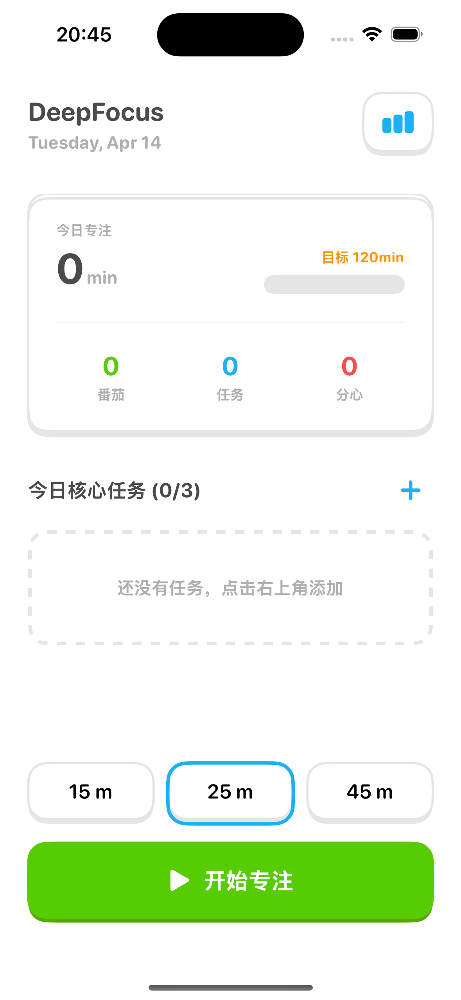
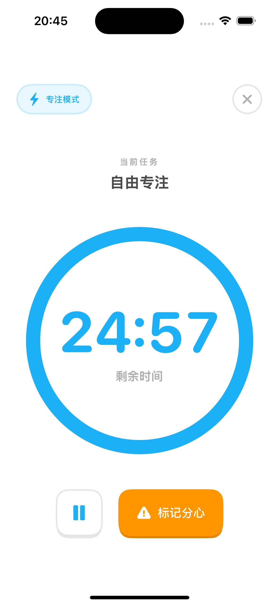
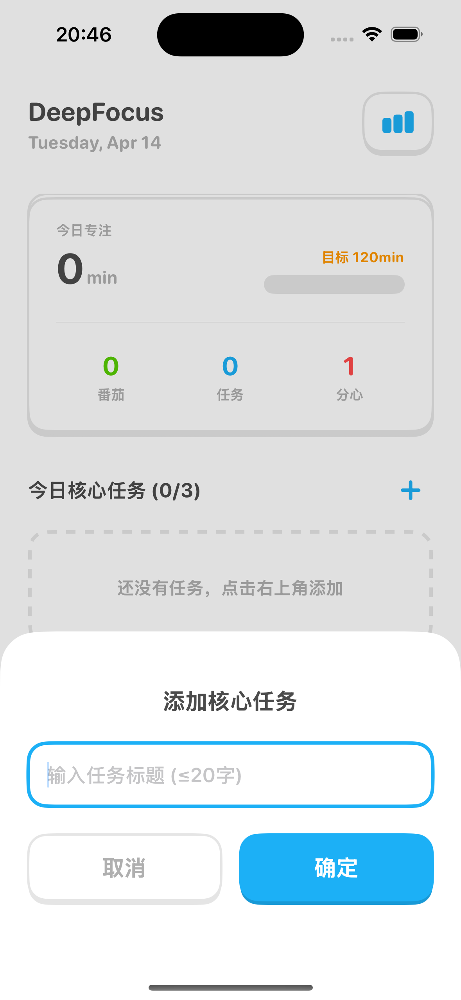
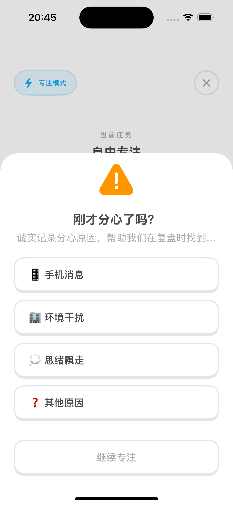
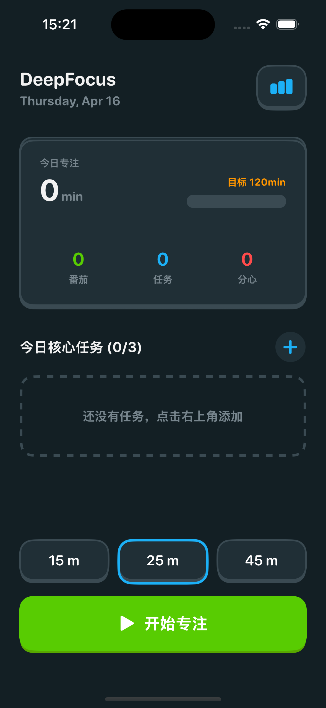
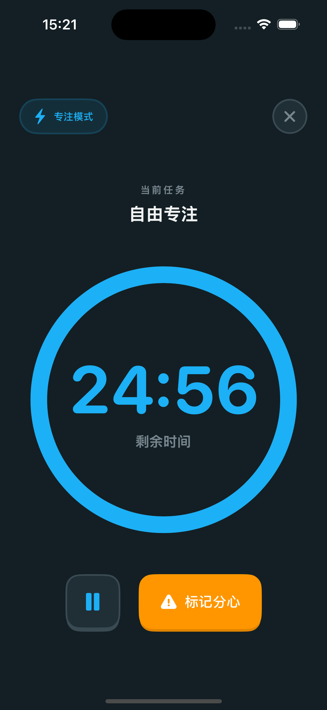
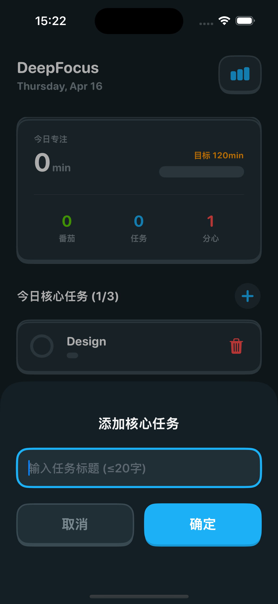
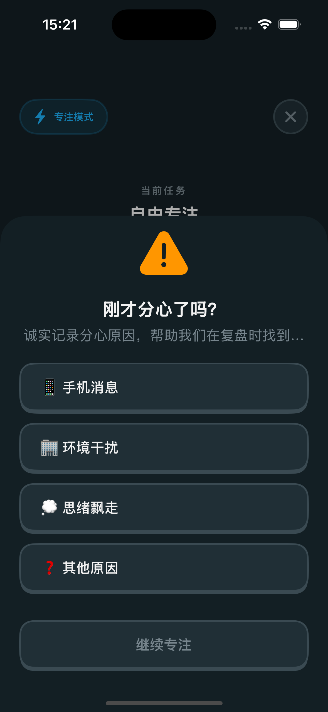

# DeepFocus

一个现代、无干扰的专注计时应用，使用SwiftUI构建，旨在帮助用户保持 productivity并有效跟踪专注会话。

## 功能特点

- **专注计时器**：可自定义的专注会话，提供15、25和45分钟选项
- **任务管理**：每天最多添加3个核心任务并跟踪其完成情况
- **分心跟踪**：记录分心情况并分类原因，提高自我意识
- **休息模式**：每个专注会话后自动进入5分钟休息时间
- **详细统计**：每周专注趋势和洞察，帮助提高生产力
- **美观界面**：现代、干净的界面，带有流畅的动画和过渡效果

## 截图





## 开始使用

### 先决条件

- Xcode 15.0+
- iOS 17.0+
- Swift 5.9+

### 安装

1. 克隆仓库：

```bash
git clone https://github.com/yourusername/deepfocus.git
cd deepfocus
```

2. 在Xcode中打开项目：

```bash
open deepfocus.xcodeproj
```

3. 在模拟器或物理设备上构建并运行应用。

## 使用方法

1. **主屏幕**：查看每日统计数据并添加核心任务
2. **开始专注**：选择持续时间并开始专注会话
3. **专注期间**：跟踪剩余时间并在需要时标记分心
4. **休息时间**：每个专注会话后休息5分钟
5. **统计视图**：查看每周趋势和洞察

## 项目结构

```
deepfocus/
├── Assets.xcassets/         # 应用图标和颜色
├── Design/                  # 设计系统和样式
├── Models/                  # 数据模型
├── Store/                   # 状态管理
├── Views/                   # UI视图
│   ├── ContentView.swift    # 主导航
│   ├── FocusTimerView.swift # 专注计时器界面
│   ├── HomeView.swift       # 主屏幕
│   ├── RestView.swift       # 休息时间界面
│   └── StatsView.swift      # 统计和洞察
└── deepfocusApp.swift       # 应用入口点
```

## 关键组件

- **FocusStore**：可观察类，管理应用状态和数据持久化
- **任务管理**：添加、切换和删除每日任务
- **专注会话**：跟踪专注时间和分心情况
- **统计数据**：生成每日和每周专注数据
- **UI组件**：自定义按钮样式和动画

## 技术栈

- SwiftUI用于UI开发
- Observable用于状态管理
- UserDefaults用于数据持久化
- Charts用于数据可视化

## 贡献

欢迎贡献！请随时提交Pull Request。

## 许可证

本项目是开源的，可在MIT许可证下使用。

## 致谢

- 灵感来自番茄工作法
- 设计注重用户体验和生产力
- 使用SwiftUI的现代声明式语法构建